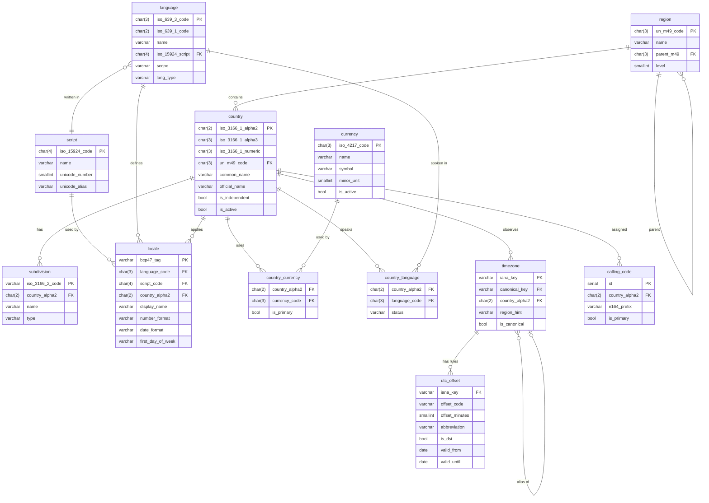

# Mímisbrunnr

> Mímisbrunnr — the well of wisdom at Yggdrasil's roots, guarded by Mímir, where Odin traded an eye for a single drink of it.

*Image credit: [@norsemythologyclips](https://www.instagram.com/norsemythologyclips/) — go follow them.*

The reference-data store of the Norse Architecture — **`Norse.ReferenceData.Data`**: entities, view models, TSV seeders (nietras Sep), and EF migrations for canonical external-standard data. First tenants: ISO country codes, ISO currency codes, and IANA time zones. In the dependency chain it rides on Urdarbrunnr's EF foundation and everything below; Mímir rides on it.

## Status

The first seed case — UN M49 reference data (`Region`/`CountryOrArea`) — has its raw-source-to-TSV conversion tooling live: `tools/SeedTool` (a dev-only console app, never packed or AOT-published) reads `seeds/raw/UNSD — Methodology.csv` via Svartalfheim's `Norse.Primitives.Ingestion` and produces the curated `seeds/region.tsv`/`seeds/country-or-area.tsv`, both committed as this realm's real seed data. The EF entities, migration, and seed contributor that will actually load these TSVs into `norse_referencedata` are not yet built — that's the next slice, specced in Glitnir's `docs/Mimisbrunnr/` but not yet planned/coded. Everything beyond this first seed case (currency, language, script, locale, timezone — see the ERD sketch below) remains unconverged; design happens first: brainstorm → spec → plan, recorded in Glitnir's `docs/Mimisbrunnr/`, before any further project is scaffolded here.

## Initial sketch of reference data plan

## Why two repos

Mímisbrunnr and Mímir are one bounded context split across two repositories for a specific, verified reason: reference-data content (IANA reissuing time zone data, ISO adding or redenominating currencies) changes far more often than the service and component code that serves it, and the platform's release tooling only supports repo-scoped tags — packing and publishing happen for an entire repo at once, not per project. Splitting the repository is what lets `Data` cut a release without dragging `Components`/`Web.Server`/`Worker` along, and vice versa. This pair is a template for anyone whose own reference data has the same shape — not a pattern the platform applies by default.

## The cosmos

Mímisbrunnr is one realm of the [Norse Architecture](https://github.com/NorseArchitecture). The whole platform composes at [Bifröst](https://github.com/NorseArchitecture/Bifrost) — clone once, cross the bridge, and every session starts there so decisions get brainstormed across the entire landscape, not in isolation. Every design is tried in [Glitnir](https://github.com/NorseArchitecture/Glitnir), the design court, before code is forged here; this realm's specs and plans will live in the court's [docs/Mimisbrunnr/](https://github.com/NorseArchitecture/Glitnir/tree/master/docs/Mimisbrunnr) once they converge.

## Soundtrack: Óðinn við Mímis brunn (Odin at the Well of Mimir)

